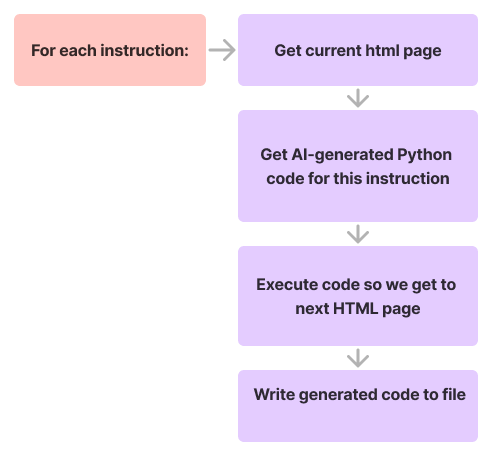
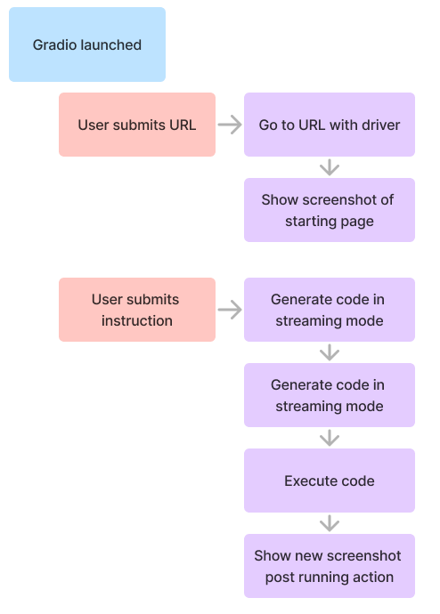

# LaVague: Under the Hood

## Lavague build

The build command generates code for your actions and saves them to a file which can then be executed locally.

> See the code in the `build()` method in init.py

### Initial set-up key steps

1. Parse CLI arguments

2. Configure our actionEngine based on config file (`--config` argument): `action_engine, get_driver = load_action_engine(config_path)`

    This will set the LLM, the embedding model, the prompt, the cleaning function etc. to be used as specified in the config file - see the customization guide for full details.

3. Load url and instructions from instructions file (--instructions argument): `base_url, instructions = load_instructions(file_path)`

### Key steps for each instruction:

For each instruction in your instructions file (file passed to `--instructions`):

1. Get current HTML page: `html = abstractDriver.getHtml()`

2. Get AI-generated Python code for this instruction: `code = action_engine.get_action(instruction, html)</code>`

    Find out more about this method in the section below

3. Execute code so we get to next html page for next instruction: `exec(code)</code>`

4. Write generated code to file: `file.write(output)`

### action_engine.get_action() method

> See code in actionEngine.py

This is a key method, where we:

- Perform RAG to get the most relevant chunks of the HTML code: `query_engine = self.get_query_engine(html, streaming=False)`
- Query the LLM to get generated coderesponse: `query_engine.query(query)`
- Apply our cleaning function to the generated code: `code = self.cleaning_function(code)`

## Lavague launch

The `lavague [OPTIONS] launch` command creates a Gradio demo which you can open in your browser to generate and debug/preview actions.

> See the code in the **launch() **method in init.py

### Initial set-up key steps

1. Parse CLI arguments

2. Configure our actionEngine based on config file (--config argument): `action_engine, get_driver = load_action_engine(config_path)`

3. Initialize a Gradio command_center module with your actionEngine and driver: `command_center = GradioDemo(action_engine, driver)`

4. Load url and instructions from instructions file (--instructions argument): `base_url, instructions = load_instructions(file_path)`

5. Run the Gradio: `command_center.run(base_url, instructions)`

### Command_center.run() method

> Code available in command_center.py

This is where the Gradio layout and input events are defined and we launch the Gradio. Note we launch it with debug and share options set to true. The latter allows us to view the Gradio if we are working in a remote environment.

When user enters a URL:

We initialize our driver to go to the URL and display an initial screenshot of the web page:

see the `__update_image_display()` method

When user enters instruction:

1. We generate code with LLM using streaming: The `process_instructions()` calls the actionEngine `get_action_streaming()` method - this is similar to the `get_action()` method but supports streaming so we can see the code generate in real-time in the Gradio

2. We then execute the AI-generated python code: `exec(code)`

3. We then update screenshot of web page after action applied: see the `__update_image_display()` method