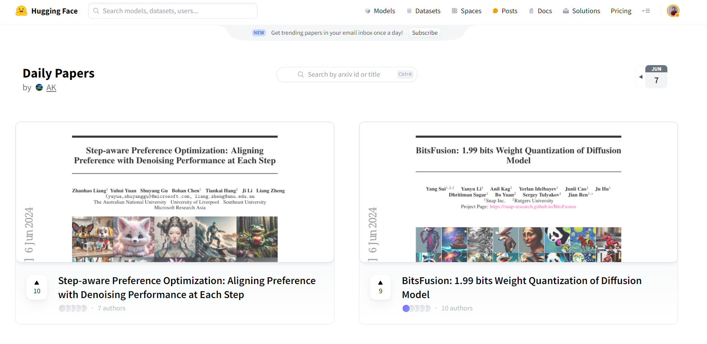

# Hugging Face Papers retrieval

<a target="_blank" href="https://colab.research.google.com/github/lavague-ai/LaVague/blob/add-example/docs/docs/examples/notebooks/paper-retrieval-example.ipynb">
</a>

This notebook shows how one can use LaVague to create an agent that can outperform Gemni or ChatGPT on the task of finding the latest hotest papers on [HuggingFace Papers](https://huggingface.co/papers)!



We will create the agent and serve it through a [Gradio](https://huggingface.co/papers) interface.

You can see in the demo below how our agent is able to outperform both Gemini and ChatGPT to answer the query `"What is the most trendy recent paper on LLava on Hugging Face papers? Provide the date and a summary of the paper"`.

<figure class="video_container">
  <video controls="true" allowfullscreen="true">
    <source src="https://github.com/lavague-ai/LaVague/blob/add-example/docs/assets/hf_demo_papers.mp4?raw=true" type="video/mp4">
  </video>
</figure>

## Pre-requisites

**Note**: We use OpenAI's models, for the embedding, LLM and Vision model. You will need to set the `OPENAI_API_KEY` variable in your local environment with a valid API key for this example to work.

If you don't have an OpenAI API key, please get one here: https://platform.openai.com/docs/quickstart/developer-quickstart

## Installation

We start by downloading LaVague.

```bash
pip install lavague
```

## Demo

We start here by pulling extra knowledge about Hugging Face's Papers pages to ensure the `WorldModel` will provide the right reasoning steps.

You can learn more about building Agents with LaVague in our [webinar](https://www.youtube.com/watch?v=bNE4s8h3CIc).

```bash
wget https://github.com/lavague-ai/LaVague/blob/main/examples/knowledge/hf_knowledge.txt
```

We can now define our agent and run it to create a Gradio demo.

```python
from lavague.drivers.selenium import SeleniumDriver
from lavague.core import ActionEngine, WorldModel
from lavague.core.agents import WebAgent

selenium_driver = SeleniumDriver()
action_engine = ActionEngine(selenium_driver)
world_model = WorldModel()
world_model.add_knowledge("hf_knowledge.txt")

agent = WebAgent(world_model, action_engine)
agent.get("https://huggingface.co/papers")
agent.demo("What is the most trendy recent paper on LLava on Hugging Face papers? Provide the date and a summary of the paper")
```