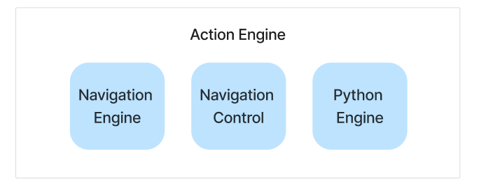

# Action Engine

### What is the Action Engine?

The Action Engine module is responsible for transforming natural language instructions into code and executing it.

The Action Engine module contains three sub-engines:



- 🚄 Navigation Engine: Generates and executes Selenium code to perform an action on a web page
- 🐍 Python Engine: Generates and executes code for tasks that do not involve navigating or interacting with a web page, such as extracting information
- 🕹️ Navigation Control: Performs frequently required navigation tasks without needing to make any extra LLM calls. So far we cover: scroll up, scroll down & wait


### Getting started with the Action Engine

In our agentic workflow, the agent first gets the next instruction and the name of the next sub-engine to be used from the World Model. 

This information is then sent to the Action Engine through the `dispatch_instruction` method. 

We can test out this method directly with the Action Engine:

```python
from lavague.drivers.selenium import SeleniumDriver
from lavague.core import ActionEngine

selenium_driver = SeleniumDriver(headless=False, url="https://huggingface.co/")
action_engine = ActionEngine(
    driver=selenium_driver,
)

# Dispatch an instruction to the Navigation Engine
engine_name = "Navigation Engine"
instruction = "Click on the Models button in the top menu"

# Execute the instruction and get the output if applicable
success, output = action_engine.dispatch_instruction(engine_name, instruction)
```

The `dispatch_instruction` method will call the `execute_instruction` method for the relevant sub-engine, which will:

In the case of the Navigation and Python engines:

- Performs RAG - it is at this point we use the Action Engine's `embedding` model
- Queries the `LLM` with our `prompt template` to generate the code needed to perform our action
- Runs the `extractor` or cleaning function to extract code only from our LLM response

And in all cases then:

- Executes the code using the Action Engine's `driver`
- Logs information about the action process with the Engine's `logger`

The `dispatch_instruction` method returns an ActionResult object, which contains:
    - instruction: the instruction an action was generated for
    - code: the generated code for the actoin
    - success: whether the code was executed succesfully or not
    - output: the output of executing the action where relevant, such as the result of a knowledge retrieval action using the Python Engine

> Note, the Navigation Control skips the RAG and LLM query steps by using pre-defined code for common navigation tasks

### Customizing an Action Engine's 

#### Action Engine from Context

You can customize the `LLM` and `embedding model` used by the Action Engine by instantiating it with the `ActionEngine.from_context` method and passing it a `Context`.

Details on how to do this are provided in our [customization guide](../get-started/customization.md).

#### Action Engine optional parameters

There are also numerous optional arguments that can be passed to the Action Engine, alongside the required `driver` argument, which you can view here:

??? note "Optional arguments"
    | Parameter               | Description                                                                                                                                                                                                                                  |
    |-------------------------|----------------------------------------------------------------------------------------------------------------------------------------------------------------------------------------------------------------------------------------------|
    | navigation_engine     | The Navigation Engine to be used                                                                                                                                                                                                             |
    | python_engine         | The Python Engine to be used                                                                                                                                                                                                                 |
    | navigation_control    | The Navigation Control to be used                                                                                                                                                                                                            |
    | llm                   | The LLM to be used - by default this is OpenAI's `gpt-4o`. You can pass this with any `llama_index.llms` LLM object.                                                                                                                          |
    | embedding             | The embedding model to be used - by default this is OpenAI's `text-embedding-3-large`. You can pass this any `llama_index.embeddings` embedding model object.                                                                                 |
    | retriever             | The `Retriever` to be used by the Navigation Engine for RAG - by default we use the [OpsmSplitRetriever](https://github.com/lavague-ai/LaVague/blob/4768a09ae282f078dbf0edd9c9ee6f7bdf8be48f/lavague-core/lavague/core/retrievers.py#L86).    |
    | prompt_template       | The prompt template to be used by the Navigation Engine to query the LLM. You can view our default Navigation Engine prompt template [here](https://github.com/lavague-ai/LaVague/blob/4768a09ae282f078dbf0edd9c9ee6f7bdf8be48f/lavague-integrations/drivers/lavague-drivers-selenium/lavague/drivers/selenium/base.py#L177). |
    | extractor             | The cleaning function to run on the LLM response before executing the generated code. You can view our default extractor [here](https://github.com/lavague-ai/LaVague/blob/4768a09ae282f078dbf0edd9c9ee6f7bdf8be48f/lavague-core/lavague/core/extractors.py#L11).                       |
    | time_between_actions  | A float value for the time in seconds to wait between actions - this can be useful where you want to enforce a delay between actions to allow elements more time to load - by default, this is 1.5 seconds                                     |
    | n_attempts            | The number of attempts the Navigation Engine should take to successfully perform an action - by default, this is 5                                                                                                                             |
    | logger                | The AgentLogger instance used to log information about the Action Engine                                                                                                                                        |


!!! tip "More info"
    For guidance on using the Agent Logger module to get more information about our Action Engine, such as viewing the code generated, see our [Agent Logger guide](./local-log.md)
    
    For more details about the Navigation Engine, see our [Navigation Engine module guide](./navigation-engine.md).

### Display mode

A final thing to note is the Action Engine's `set_display` method. 

This method is used by the `Web Agent` when its `run` method is passed a `display=True` boolean value:

```python
agent.run(objective, display=True)
```

When `display` is set to True, the Action Engine will display images updated in real-time as actions are performed on our browser. This can be useful when we are using the driver in headless mode and still want to visually see the impact of our actions.

We can also use this method directly on the Action Engine with the following code:
```python
action_engine.set_display(True)
```