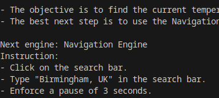

# Guide to debugging with LaVague

When using LaVague, you may find that our Web Agents are not always able to succesfully achieve the objective you set them out of the box, leading to either incorrect results or `Navigation errors`.

Our Agents are designed to be as customizable as possible so you can adjust components to get the best result for your particular use case.

Problems with performance usually stem from one of three components: The World Model, the Retriever or the Action Engine.

In this guide, we'll take a look at how you can debug errors with each of these components and rectify them.

### The World Model

Case one: The World Model's is either providing the Action Engine with poor instructions or is providing the Agent with a bad final output at the end of the AI pipeline.

#### How to detect World Model performance issues?

Bad insturctions from the World Model tend to be the easiest performance issue to spot and debug since the World Model outputs its "thoughts" and next instruction in real-time.

### Adding knowledge to World Model prompt

In the following example, I set an objective to "Return the temperature now in Birmingham UK?"" on "weather.com":

```python
selenium_driver = SeleniumDriver(headless=False)
world_model = WorldModel()
action_engine = ActionEngine(driver=selenium_driver)
agent = WebAgent(world_model, action_engine)

url = "https://weather.com/"
objective = "What is the temperature now in Birmingham UK?"
agent.get(url)
ret = agent.run(objective)
print(ret.output)
```

As a user, I quickly notice that when I search for a location on the website, the search button does not appear to be functioning and is unresponsive; instead a drop-down list with clickable links loads for the locations based on my search entry.

In my first attempt at my objective with LaVague, the World Model does not understand that the search button is not working and keeps instructing the Action Engine to click on the search button, causing `navigation errors`:


With situations like this, we can teach our World Model to behave differently and produce different instructions by providing it with extra knowledge.

In my case, I will provide it with the following knowlegde which I save in my `knowlegde.txt file`:

Search operations for this website have specific instructions.

!!! note "Knowlegde.txt file"
    We should not press the search button. Instead we should just type a search entry into the search bar and then wait for 3 seconds must be sure to wait for 3 seconds.

    Example:

    Thoughts:
    - The screenshot shows the homepage of the website 'weather.com'.
    - The objective is to return the current temperature in the location you wish to search for
    - The best next step is to use the Navigation Engine to search for the location on the website.
    Next engine: Navigation Engine
    Instruction:
    - Click on the search bar.
    - Type the location in the search bar.
    - Enforce a pause of 3 seconds

I can send this model to my World Model by providing the path to my .txt file with the `add_knowledge()` method:

world_model = WorldModel()
world_model.add_knowledge(file_path="knowledge.txt")

When, I retry my original code to get the temperature in Birmingham. The World Model now gives the following first set of instructions:



By not clicking on the search button after typing in the search bar, and instead pausing, we avoid a series of errors and the website has time to load its drop-down menu, which will then be taken into consideration in the screenshot taken by the World Model when creating its next set of instructions.


The World Model is then able to click on the link to the Birmingham weather page and correctly return the current temperature in Birmingham, UK.


✅ By adding a small amount of text, we were able to teach our World Model how to navigate correctly on this website.

### The Retriever

Case two: The Action Engine has been given a good instruction, but the Navigation Engine fails to generate code targetting the correct HTML element because the retriver did not retrieve and pass on the relevant HTML element, so the LLM does not have the correct XPATH for this element.

### Increasing top_k

### Changing elements retrieved

### Changing retriever


### The Action Engine's LLM

Case three: The Navigation or Python Engine has received a correct instruction and (in the case of the Navigation Engine) has the correct nodes, but it is still generating incorrect code.

### Adding knowledge to LLM prompt

### Changing LLM


