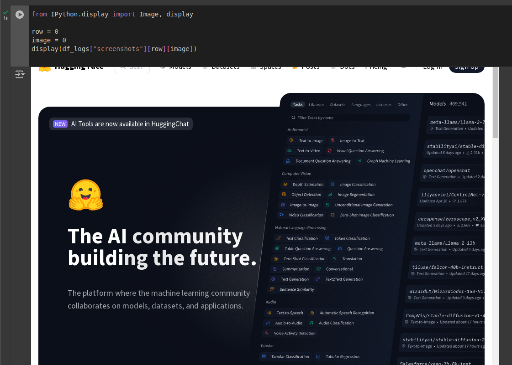

# Agent Logger

When you use `agent.run()`, the `AgentLogger` captures information about the last agentic run, which can be retrieved and viewed as a Panda's DataFrame. 

This DataFrame is accessible via the `agent.logging.return_pandas()` method and contains the following columns of information per step in the agentic run attempted:

!!! note "Local log fields"
    - `current_state:` This contains information about the external or internal observations the World Model used for this step
    - `past`: history of instructions sent to the Action Engine by the World Model and whether they succeeded or failed
    - `world_model_prompt`: The prompt sent to the World Model to generate the next instruction for the Action Engine needed to achieve the global objective.
    - `world_model_output`: The reasoning of the World Model, the engine it selected to carry out the next instruction and the instruction itself
    - `world_model_inference_time`: Time taken for World Model inference
    - `engine_log`: contains logs related to the specific Action Engine sub-engine used.
    - `success`: Whether the step was successful or not in achieving objective
    - `output`: Output of the step, if relevant (for example, information scraped from a web page)
    - `code`: The code generated for this step
    - `html`: The code retrieved from the web page and sent as context for the action
    - `screenshots_path`: The path where your screenshots are stored locally
    - `url`: The url on which the action was run
    - `date`: The date and time at which the action was run
    - `run_id`: The unique ID for the agent run
    - `step`: An integer representing which step this row refers to in a multi-step pipeline
    - `screenshots`: All screenshots taken during the run

## Examples

Let's take a look at how we can access the logs after using `agent.run()` and examine specific information from the logs.

Firstly, we need to use our agent as usual, and then retrieve the logs DataFrame:

```python
from lavague.drivers.selenium import SeleniumDriver
from lavague.core import ActionEngine, WorldModel
from lavague.core.agents import WebAgent

selenium_driver = SeleniumDriver(headless=False)
action_engine = ActionEngine(selenium_driver)
world_model = WorldModel()

agent = WebAgent(world_model, action_engine)

agent.get("https://huggingface.co/")
agent.run("Go to the first Model in the Models section")

# Retrieve pandas DataFrame with logs
df_logs = agent.logger.return_pandas()
```

Now, let's look at the code for the last step ran from within our log DataFrame:
```python
# Pandas option to ensure we show all text in column
import pandas as pd
pd.set_option('display.max_colwidth', None)

# Print the code generated for step 0 of our run
step = 0
print(df_logs.at[step, 'code'])
```

This provides us with the following code.


Next, we can display the first screenshot taken for the first step with the following code:

```python
from IPython.display import display

step = 0
image = 0
display(df_logs["screenshots"][row][image])
```
This will display the following image.


Finally, let's take a look at the World model's reasoning for the first step:

```python
# Print the World Model thoughts generated for step 0 of our run
step = 0
print(df_logs.at[step, 'world_model_output'])
```

This gives us the following output.


??? tip "Advanced"

    The logger runs automatically whenever you use the `agent.run()` method and is accessible via `agent.logger`. However, you can directly instantiate and use our `AgentLogger` class to log information for lower-level components in our framework, such as the Action Engine.

    Let's take a look at an example of how we can do this by with the Action Engine.

    Firstly, let's create out Action Engine and instance of AgentLogger:

    ```python
    from lavague.drivers.selenium import SeleniumDriver
    from lavague.core.logger import AgentLogger
    from lavague.core import ActionEngine

    selenium_driver = SeleniumDriver(headless=True, url="https://huggingface.co/")
    action_engine = ActionEngine(
        driver=selenium_driver,
    )

    # Initialize your logger
    logger = AgentLogger()
    ```

    Next, we can start a new logger run and add our logger to our Action Engine sub-component. We will also need to collect observations from the driver as this must be added to each logger run.

    ```python
    # Start a new logging run
    logger.new_run()

    # Add logging to NavigationEngine
    action_engine.navigation_engine.set_logger(logger)

    obs = selenium_driver.get_obs()
    ```

    Now we will execute an action, add the required observations to the logger and signal to that we have finished our action with the `end_step()` method. We can then get a DataFrame with the logs for this action.

    ```python
    # Engine & instruction
    engine_name = "Navigation Engine"
    instruction = "scroll down by 200px"

    # Execute the instruction
    success, output = action_engine.dispatch_instruction(engine_name, instruction)

    # Add required driver info to logs and end the logging step
    logger.add_log(obs)
    logger.end_step()

    # Retrieve and print logs as a pandas DataFrame
    df_logs = logger.return_pandas()
    ```