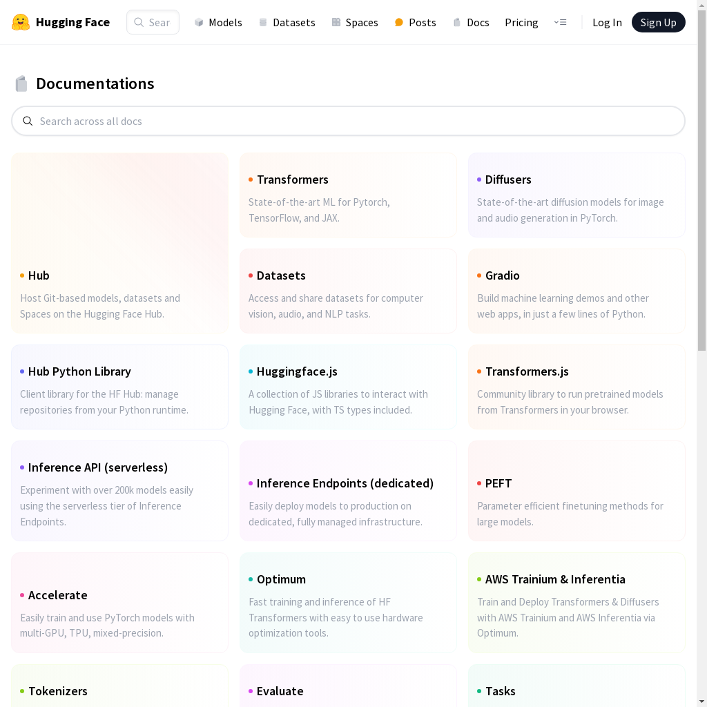
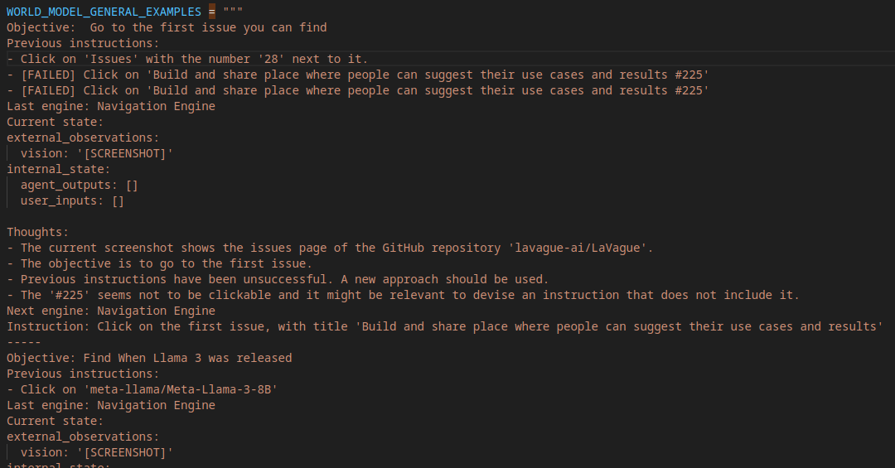

# World Model

### What is the World Model?

The World Model takes a user objective and the current state of a webpage and uses this information to generate:

- the next instruction required to eventually achieve the user objective
- the name of the Action Engine sub-engine component which should be used to execute the instruction

In our agentic workflow, the Agent will get the next instruction and engine to be used by calling the `WorldModel.get_instruction` method before passing these two strings to the Action Engine, which will handle executing the instruction.

### Getting started with the World Model 

Let's now create an instance of World Model that we can work with directly to understand better how it works.

```python
from lavague.core import  WorldModel

world_model = WorldModel()
```

The World Model receives multiple inputs to make informed decisions:
- `objective`: The user's objective
- `current_state`: Internal and external state that includes some internal memory from agent outputs and user inputs
- `past`: previous generated instructions
- `obs`: The current HTML, screenshot, URL of the webpage + the current date/time

Before we can start using our World Model, we first need to generate these observations.

```python
from lavague.drivers.selenium import SeleniumDriver

selenium_driver = SeleniumDriver(headless=True)

# Generate observations & set objective
objective = "Go on the quicktour of PEFT"
current_state, past = agent.st_memory.get_state()
obs = selenium_driver.get_obs()
```

To understand what inputs the World Model receives, we can visualize the screenshots captured during the observation process.

```python
# Visualize the screenshot
from lavague.core.logger import load_images_from_folder

images = load_images_from_folder(obs["screenshots_path"])
images[0]
```


The World Model receives multiple inputs to make informed decisions:
- Objective
- Internal and external state that comprises the current HTML, screenshot, some internal memory in agent_outputs and user provided data with user_inputs
- Past with previous instructions

```python

print("Objective: ", objective)
print("Current State: ", current_state)
print("Past: ", past)
print("Observations: ", obs)
```


We can now pass this information to the World Model to get the next instruction to be completed. 

```python
world_model_output = world_model.get_instruction(
    objective, current_state, past, obs
)

print(world_model_output)
```


The generated instruction provides insights into the World Model's thought process, including the recommended engine and instruction for the agent.

```python

from lavague.core.utilities.format_utils import (
    extract_next_engine,
    extract_world_model_instruction,
)

next_engine_name = extract_next_engine(world_model_output)
instruction = extract_world_model_instruction(world_model_output)

print(next_engine_name)
print(instruction)
```


### How does it work?

The World Model generates the next instruction by querying the multi-modal LLM (by default, we use OpenAI's gpt-4o) with our `prompt template`. 

You can print out our default World Model template with the following code or view the full template [here](https://github.com/lavague-ai/LaVague/blob/d046e6ccba87bc629b8608046b5001020fa5382e/lavague-core/lavague/core/world_model.py#L213):

```python
from lavague.core.world_model import WORLD_MODEL_PROMPT_TEMPLATE

print(WORLD_MODEL_PROMPT_TEMPLATE.template)
```


This shows us the overall guidelines. Let's now see now how [examples](https://github.com/lavague-ai/LaVague/blob/d046e6ccba87bc629b8608046b5001020fa5382e/lavague-core/lavague/core/world_model.py#L11) are provided to provide world knowledge:

```python
print(WORLD_MODEL_GENERAL_EXAMPLES)
```




If we wanted to add knowledge to our World Model prompt template, we could do so with the following code:

```python
examples = WORLD_MODEL_GENERAL_EXAMPLES + added_knoweldge
world_model = WorldModel(examples=examples)
```

!!! tip "Improving performance"
    By adding knowledge, we can improve the World Model's performance where it is failing to generate correct next instructions.

### Customizing your World Model

### World Model from Context

You can customize the `mm_llm` multi-modal LLM used by the World Model by instantiating it from a `Context` object with the `WorldModel.from_context` method.

Details on how to do this are provided in our [customization guide](../get-started/customization.md).

### Optional arguments

Alternatively, you can pass your World Model class any of the four key customizable arguments:
- `mm_llm`: A Multi-modal LLM. This can be any `llama_index.multi_modal_llms` object. By default, we use OpenAI's gpt-4o.
- `prompt_template`: The prompt template used to query the multi-model LLM to generate the next instruction
- `examples`: A string containing examples of how we expect the WorldModel to reason and produce a good next instruction
- `logger:`: An AgentLogger which records information about the World Model

Once initialized, the World Model can be used as seen previously.